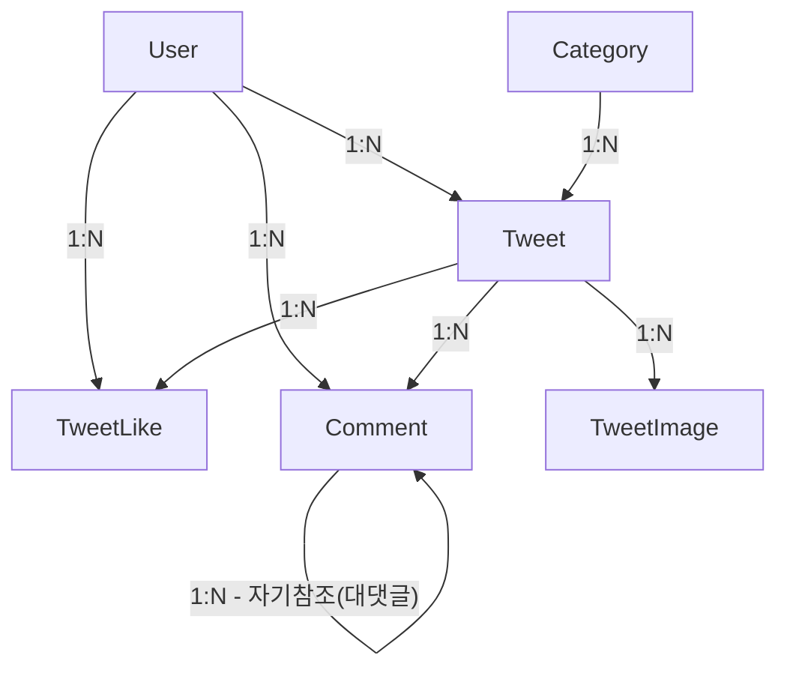
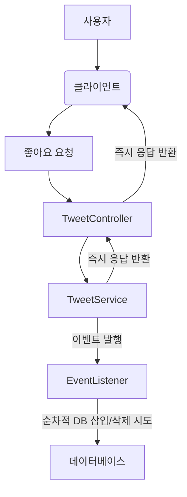

# 백엔드 소셜 미디어 피드

> TypeScript, NestJS를 사용하여  
> 소셜 미디어 피드 백엔드 시스템 구현입니다.

## 실행 방법

### 준비

- Node.js, (개발 시 v22 사용)
- Docker (MySQL 데이터베이스 실행용)

### 환경 변수 설정

프로젝트 루트 디렉토리에 `.env` 파일을 생성하고 다음 환경 변수들을 설정합니다.  
NODE_ENV 등의 값 들은 생략했습니다.

```
# 애플리케이션 포트
PORT=3000

# 데이터베이스 설정
MYSQL_HOST=localhost
MYSQL_PORT=3306
MYSQL_USER=root
MYSQL_PASSWORD=mysql_root_password
MYSQL_DATABASE=database_name

# JWT 설정
JWT_SECRET_KEY=jwt_secret_key
```

### 애플리케이션 실행

개발 모드로 애플리케이션을 실행합니다.

```bash
npm run start:dev
```

애플리케이션이 성공적으로 시작되면 `http://localhost:3000/docs`에서 Swagger 문서를 확인할 수 있습니다.

카테고리는 기본적으로 시딩했습니다.  
회원가입, 로그인, swagger의 Authorize 이후 요청을 확인할 수 있습니다.

### 테스트

E2E 테스트를 실행합니다.  
테스트 실행 시 `Testcontainers`를 사용하여 격리된 테스트용 MySQL 데이터베이스가 자동으로 생성 후  
테스트 후 사라집니다.

```bash
npm run test:e2e
```

## 사용한 기술 스택 및 선택 이유

- **TypeORM**: NestJS에서 TypeORM이 권장되고 기본적으로 지원 모듈이 있어 엔티티와 데이터베이스 간의 매핑을 효율적으로 관리할 수 있습니다.
- **MySQL**: 안정적이고 널리 사용되는 관계형 데이터베이스입니다.
- **Testcontainers**: 격리된 테스트 환경 제공을 위해 사용했습니다.  
  테스트 실행 시 실제 데이터베이스 인스턴스를 Docker 컨테이너로 띄워 실제 환경과 가장 유사하게 동작합니다.

## 디렉토리 구조

> 각 모듈 내에서 파일이 하나만 존재하여 추가적인 하위 디렉토리 구조가 불필요한 경우,
> 패키지 없이 파일을 배치하여 불필요한 계층화를 피하고 가독성을 높였습니다.

```
src/
├── app.module.ts         # 애플리케이션의 루트 모듈
├── main.ts               # 애플리케이션 부트스트랩 파일
├── common/               # 공통 유틸리티, 필터, 인터셉터 등
│   └── exception.filter.ts
├── config/               # 환경 설정 관련 파일
│   ├── auth.config.ts
│   ├── database.config.ts
│   └── winston.config.ts
└── modules/              # 도메인별 모듈 분리
    ├── auth/             # 인증 및 인가 관련 모듈
    ├── categories/       # 게시물 카테고리 관련 모듈
    ├── comments/         # 댓글 관련 모듈
    ├── tweets/           # 트윗(게시물) 관련 모듈
    └── users/            # 사용자 관련 모듈
```

## 엔티티 관계도 (ERD)

실무의 경우 카테고리가 사라지는 경우 등을 대비하여 최소한으로 연관관계를 구현하지만  
최대한 모든 연관관계를 구현해봤습니다.



## 기타

### 좋아요 기능의 비동기 이벤트 처리

좋아요 기능은 사용자에게 즉각적인 반응을 제공하는 것이 중요하다고 판단하여 비동기 이벤트 기반으로 처리했습니다.  
사용자의 좋아요 요청은 서비스 계층에서 즉시 이벤트를 발행하고 응답을 반환합니다.  
데이터베이스 반영은 이벤트 리스너에서 비동기적으로 처리됩니다.  
사용자 경험에 영향을 주지 않으면서 데이터 일관성을 유지합니다.

이 과정에서 발생할 수 있는 중복 좋아요 요청에 대한 데이터베이스의 `Unique` 제약 조건 위반 오류는  
이벤트 리스너 내부에서 `try...catch` 블록으로 처리되고 warn 레벨의 로그만 남깁니다.


